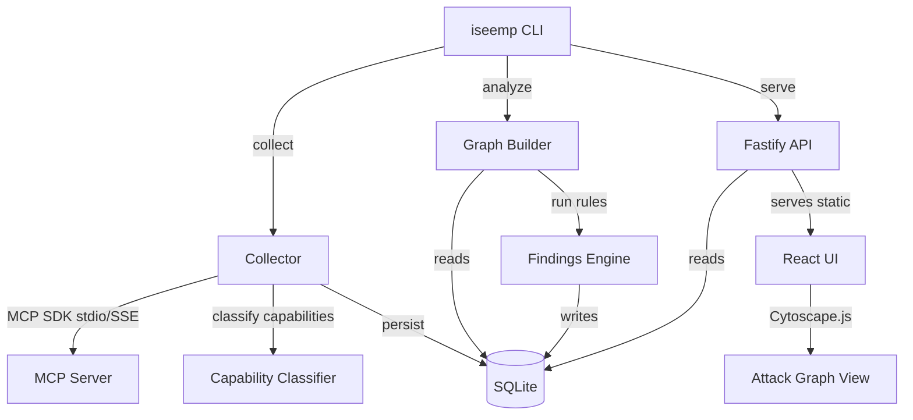

# ISeeMP — I See Model Paths 🔍


> **Execution path analysis engine for AI systems** — maps how models, tools, and context interact, revealing what your AI can actually be made to do.

ISeeMP (I See Model Paths) is a read-only static analyzer for [Model Context Protocol](https://modelcontextprotocol.io/) ecosystems. It enumerates MCP servers, classifies tool capabilities with deterministic rules (no LLM required), builds an attack graph, and surfaces security findings in a local SQLite database with a visual web UI.

## Table of Contents

- [What it does](#what-it-does)
- [Core concepts](#core-concepts)
- [Prerequisites](#prerequisites)
- [Quickstart](#quickstart)
- [End-to-end local demo (safe fixture)](#end-to-end-local-demo-safe-fixture)
- [Web UI screenshots](#web-ui-screenshots)
- [Architecture](#architecture)
- [Capability model](#capability-model)
- [Risk categories](#risk-categories)
- [Configuration discovery](#configuration-discovery)
- [CLI reference](#cli-reference)
- [HTTP API reference](#http-api-reference)
- [Data model (SQLite)](#data-model-sqlite)
- [Development](#development)
- [Monorepo layout](#monorepo-layout)
- [Troubleshooting](#troubleshooting)
- [MVP scope and roadmap](#mvp-scope-and-roadmap)
- [Safety notes](#safety-notes)

## What it does

ISeeMP traces causal chains in AI tooling environments:

- **What gets invoked** — path discovery
- **What flows where** — path execution graphing
- **What crosses trust boundaries** — path evidence and findings

Unlike scanners that only inventory capabilities, ISeeMP highlights chained risk across tools and servers.

## Core concepts

| Term | Meaning |
|---|---|
| Model Paths | Core concept |
| Path discovery | Engine |
| Path execution | Testing |
| Path evidence | Traces |
| Path risk | Findings |

## Prerequisites

- Node.js `>=20`
- pnpm `>=9`
- Access to MCP server configs and/or URLs you want to analyze

## Quickstart

```sh
# 1) Clone and install
git clone https://github.com/goldjg/i-see-mp.git
cd i-see-mp
corepack enable
corepack prepare pnpm@latest --activate
pnpm install

# 2) Create config: iseemp.config.json
cat > iseemp.config.json << 'EOF_CONF'
{
  "mcpServers": {
    "github": {
      "command": "npx",
      "args": ["-y", "@modelcontextprotocol/server-github"],
      "env": { "GITHUB_PERSONAL_ACCESS_TOKEN": "ghp_your_token_here" }
    }
  }
}
EOF_CONF

# 3) Build
pnpm build
pnpm --filter @iseemp/web build

# 4) Collect + analyze
node packages/cli/dist/index.js collect
node packages/cli/dist/index.js analyze

# 5) Serve UI
node packages/cli/dist/index.js serve
# Open http://localhost:7474
```

## End-to-end local demo (safe fixture)

Use the deterministic `examples/safe-mcp` server to validate the full flow locally.

```sh
# Build the safe fixture
pnpm --filter safe-mcp build

# Create a local config that points to the fixture
cat > iseemp.config.json << 'EOF_CONF'
{
  "mcpServers": {
    "safe-mcp": {
      "command": "node",
      "args": ["examples/safe-mcp/dist/index.js"]
    }
  }
}
EOF_CONF

# Build, collect, analyze, serve
pnpm build
pnpm --filter @iseemp/web build
node packages/cli/dist/index.js collect --config iseemp.config.json
node packages/cli/dist/index.js analyze
node packages/cli/dist/index.js serve --port 7474
```

## Web UI screenshots

These screenshots were generated via Playwright.

### Dashboard


### Graph


### Tools


### Findings


## Architecture



## Capability model

ISeeMP classifies tools using name/description/schema heuristics:

| Capability | Description | Risk Score |
|---|---|---|
| `RUN_SHELL` | Execute arbitrary shell commands | 90 |
| `EXECUTE_CODE` | Run code/scripts | 85 |
| `READ_SECRET` | Read secrets, tokens, credentials | 80 |
| `MUTATE_IDENTITY` | IAM, roles, permissions | 80 |
| `MUTATE_CLOUD_RESOURCE` | AWS/Azure/GCP resources | 75 |
| `EXPORT_DATA` | Bulk export/dump data | 70 |
| `SEND_EMAIL` | Send emails | 65 |
| `SEND_HTTP` | Make HTTP requests | 60 |
| `WRITE_LOCAL_FILE` | Write to local filesystem | 55 |
| `WRITE_REMOTE_DATA` | Write to remote systems | 55 |
| `QUERY_DATABASE` | Execute SQL queries | 50 |
| `CREATE_TICKET` | Create issues/PRs/tickets | 40 |
| `READ_REMOTE_DATA` | Read from remote sources | 35 |
| `READ_LOCAL_FILE` | Read local filesystem | 30 |
| `UNKNOWN` | Unclassified | 10 |

## Risk categories

| Category | Description |
|---|---|
| `DATA_EXFILTRATION` | Server can read files AND make HTTP requests |
| `PRIVILEGED_MUTATION` | Tools that mutate cloud or identity resources |
| `CODE_EXECUTION` | Tools with shell/code execution capability |
| `TRUST_BOUNDARY_CROSSING` | Server hosted at non-localhost URL |
| `SENSITIVE_DATA_EXPOSURE` | Tools that can read secrets/credentials |
| `UNVERIFIED_SERVER` | Server not cryptographically verified |
| `OVERBROAD_TOOL` | Single tool with 4+ capabilities |
| `DANGEROUS_TOOL_CHAIN` | Server has READ_SECRET + SEND_HTTP (exfil chain) |

## Configuration discovery

Discovery order:

1. `--config <path>` explicit config
2. `iseemp.config.json` in current directory
3. Claude Desktop config
4. VS Code settings (`mcpServers` key)
5. `--server <url>` single remote server

Config format (Claude Desktop compatible):

```json
{
  "mcpServers": {
    "my-server": {
      "command": "node",
      "args": ["server.js"],
      "env": { "API_KEY": "..." }
    },
    "remote-server": {
      "url": "https://api.example.com/mcp/sse"
    }
  }
}
```

## CLI reference

```text
iseemp collect [--config <path>] [--server <url>] [--db <path>]
iseemp analyze [--collection <id>] [--db <path>]
iseemp serve [--port <n>] [--db <path>]
iseemp --help
```

### Command behavior

- `collect` — discovers MCP servers, inventories tools/resources/prompts, and persists results
- `analyze` — builds graph edges/nodes and runs findings rules
- `serve` — starts Fastify API and serves web UI (if `apps/web/dist` exists)

## HTTP API reference

| Endpoint | Method | Description |
|---|---|---|
| `/health` | GET | Liveness and timestamp |
| `/collections` | GET | List collections |
| `/servers?collectionId=...` | GET | Servers for collection (latest by default) |
| `/tools?collectionId=...` | GET | Tools for collection (latest by default) |
| `/graph?collectionId=...` | GET | Graph nodes/edges (persisted or built on read) |
| `/findings?collectionId=...` | GET | Findings for collection |

## Data model (SQLite)

Primary tables:

- `collections`
- `servers`
- `tools`
- `resources`
- `prompts`
- `nodes`
- `edges`
- `findings`

Reserved post-MVP testing tables:

- `test_runs`
- `evidence`

## Development

```sh
pnpm install
pnpm lint
pnpm typecheck
pnpm build
pnpm test
```

## Monorepo layout

```text
apps/web              React + Vite + Cytoscape.js UI
apps/api              Fastify API server
packages/core         Shared types + Zod schemas
packages/collector    Config discovery + MCP client
packages/graph        Graph builder + attack-path queries
packages/storage      SQLite schema + typed repositories
packages/rules        Capability classifier + findings rules
packages/cli          iseemp CLI entry point
examples/safe-mcp     Deterministic MCP fixture with known tools
```

## Troubleshooting

- **UI returns empty data**
  - Run `collect` first, then `analyze`.
  - Confirm your `--db` path is the same across commands.
- **`serve` says web UI is not built**
  - Run `pnpm --filter @iseemp/web build`.
- **Config not discovered**
  - Pass explicit `--config` path to remove ambiguity.
- **Remote server issues**
  - Verify URL/transport and credentials for that server.

## MVP scope and roadmap

### In scope

- Static analysis only (does not execute tools)
- Deterministic rules-based capability classification
- SQLite storage with append-only collections
- Local API + web UI

### Out of scope (post-MVP)

- LLM-driven fuzzing / prompt-injection probing
- Observed-call tracking (`observed_call` / `tested_path` edges)
- Multi-tenant cloud deployment
- Historical collection diff UI

### Roadmap highlights

- CI failure gates (`analyze --fail-on critical`)
- Diff views over time
- Policy-as-code custom rules

## Safety notes

- ISeeMP **never executes MCP tools** in MVP mode.
- Secrets in config env vars are **redacted** before storage.
- SQLite database is local; no automatic outbound data export.
- Remote collection uses metadata endpoints only (`listTools`, `listResources`, `listPrompts`).
