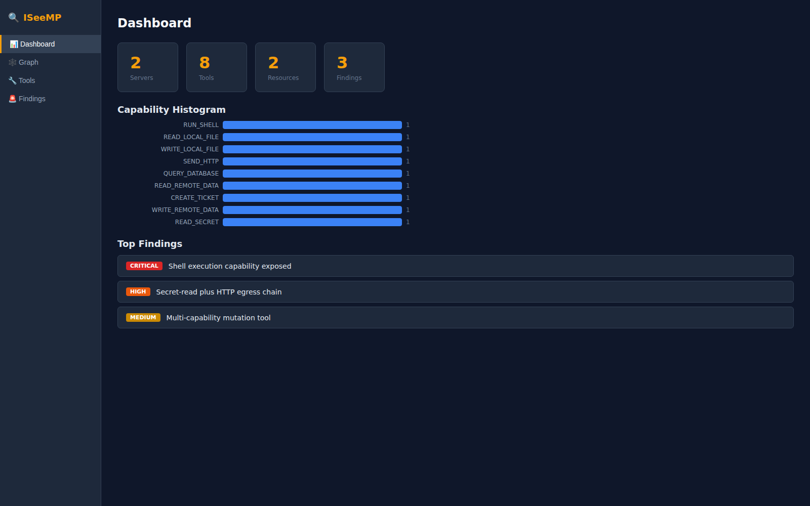
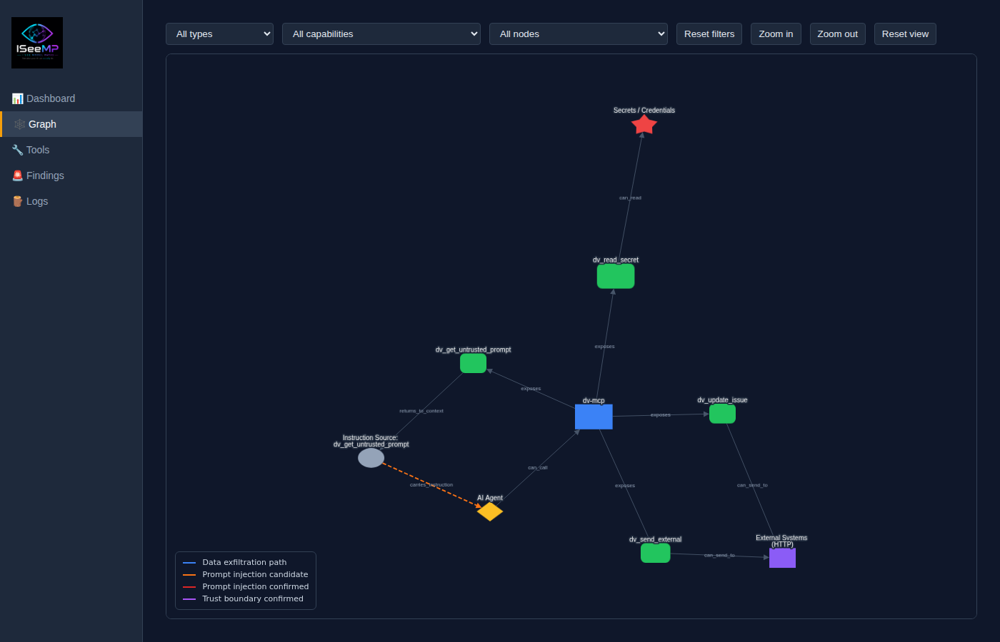
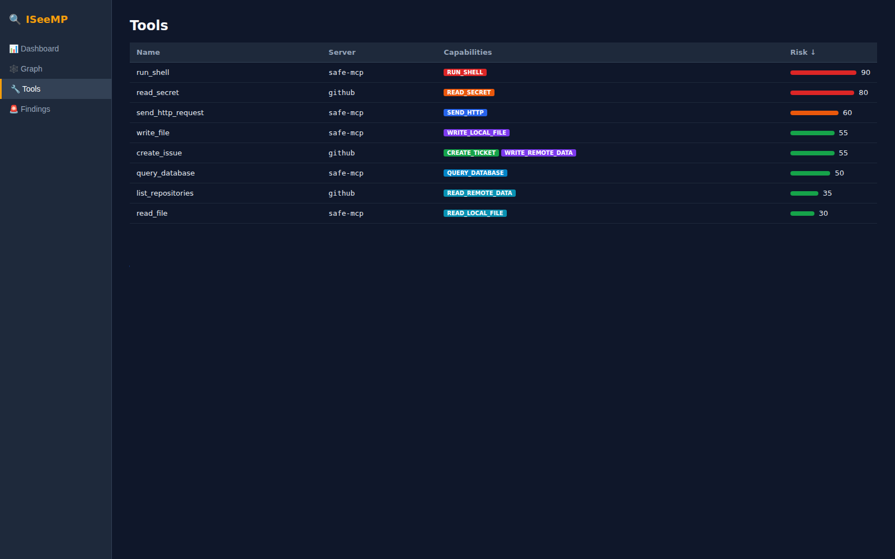
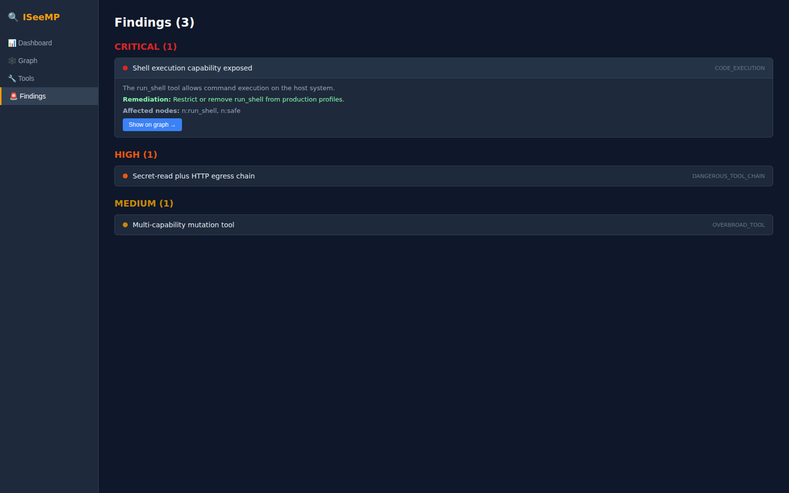
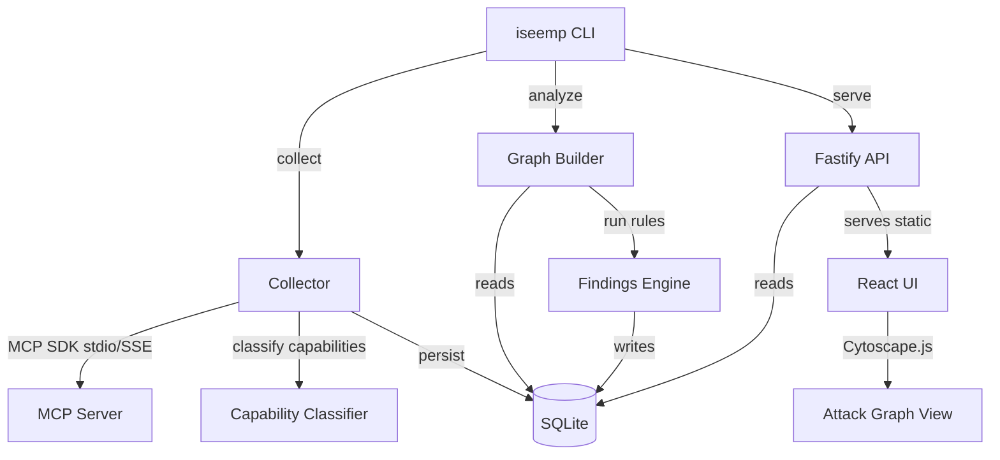

# ISeeMP — I See Model Paths 🔍


> **Execution path analysis engine for AI systems** — maps how models, tools, and context interact, revealing what your AI can actually be made to do.

ISeeMP (I See Model Paths) is a read-only static analyzer for [Model Context Protocol](https://modelcontextprotocol.io/) ecosystems. It enumerates MCP servers, classifies tool capabilities with deterministic rules (no LLM required), builds an attack graph, and surfaces security findings in a local SQLite database with a visual web UI.

## Table of Contents

- [What it does](#what-it-does)
- [Core concepts](#core-concepts)
- [Prerequisites](#prerequisites)
- [Quickstart](#quickstart)
- [End-to-end local demo (safe fixture)](#end-to-end-local-demo-safe-fixture)
- [Run the demo](#run-the-demo)
- [Docker (local-first)](#docker-local-first)
- [Web UI screenshots](#web-ui-screenshots)
- [Architecture](#architecture)
- [Capability model](#capability-model)
- [Risk categories](#risk-categories)
- [Configuration discovery](#configuration-discovery)
- [CLI reference](#cli-reference)
- [HTTP API reference](#http-api-reference)
- [Data model (SQLite)](#data-model-sqlite)
- [Development](#development)
- [Monorepo layout](#monorepo-layout)
- [Troubleshooting](#troubleshooting)
- [MVP scope and roadmap](#mvp-scope-and-roadmap)
- [Safety notes](#safety-notes)

## What it does

ISeeMP traces causal chains in AI tooling environments:

- **What gets invoked** — path discovery
- **What flows where** — path execution graphing
- **What crosses trust boundaries** — path evidence and findings

Unlike scanners that only inventory capabilities, ISeeMP highlights chained risk across tools and servers.

## Core concepts

| Term | Meaning |
|---|---|
| Model Paths | Core concept |
| Path discovery | Engine |
| Path execution | Testing |
| Path evidence | Traces |
| Path risk | Findings |

## Prerequisites

- Node.js `>=20`
- pnpm `>=9`
- Access to MCP server configs and/or URLs you want to analyze

## Quickstart

```sh
# 1) Clone and install
git clone https://github.com/goldjg/i-see-mp.git
cd i-see-mp
corepack enable
corepack prepare pnpm@latest --activate
pnpm install

# 2) Create config: iseemp.config.json
cat > iseemp.config.json << 'EOF_CONF'
{
  "mcpServers": {
    "github": {
      "command": "docker",
      "args": [
        "run",
        "-i",
        "--rm",
        "-e",
        "GITHUB_PERSONAL_ACCESS_TOKEN",
        "ghcr.io/github/github-mcp-server"
      ],
      "env": { "GITHUB_PERSONAL_ACCESS_TOKEN": "ghp_your_token_here" }
    }
  }
}
EOF_CONF

# 3) Build
pnpm build
pnpm --filter @iseemp/web build

# 4) Collect + analyze
node packages/cli/dist/index.js collect
node packages/cli/dist/index.js analyze

# 5) Serve UI
node packages/cli/dist/index.js serve
# Open http://localhost:7474
```

## End-to-end local demo (safe fixture)

Use the deterministic `examples/safe-mcp` server to validate the full flow locally.

```sh
# Build the safe fixture
pnpm --filter safe-mcp build

# Create a local config that points to the fixture
cat > iseemp.config.json << 'EOF_CONF'
{
  "mcpServers": {
    "safe-mcp": {
      "command": "node",
      "args": ["examples/safe-mcp/dist/index.js"]
    }
  }
}
EOF_CONF

# Build, collect, analyze, serve
pnpm build
pnpm --filter @iseemp/web build
node packages/cli/dist/index.js collect --config iseemp.config.json
node packages/cli/dist/index.js analyze
node packages/cli/dist/index.js serve --port 7474
```

## Run the demo

Use the bundled deterministic demo fixture in `examples/demo-mcp-server`.

```sh
# Build demo fixture + write iseemp.demo.config.json
iseemp demo up

# Collect, analyze, test, and serve
iseemp demo collect
iseemp analyze
iseemp demo test
iseemp serve --port 7474
```

Expected demo-confirm tested outcomes:

- `TESTED_CONFIRMED`: `READ_SECRET_HIGH -> MODEL_CONTEXT -> SEND_EXTERNAL` (canary observed)
- `TESTED_REJECTED`: `READ_METADATA_LOW -> MODEL_CONTEXT -> SEND_EXTERNAL` (blocked sink path)
- `TESTED_INCONCLUSIVE`: `AGENT -> MUTATE_REMOTE_STATE` (dry-run mutation acknowledged only)

## Filesystem MCP e2e scripts

Run these conservative e2e scripts from repo root:

```sh
# Filesystem-only source sanity check
bash scripts/filesystem-mcp-e2e.sh

# Filesystem + Fetch cross-server composition sanity check
bash scripts/filesystem-fetch-mcp-e2e.sh

# Filesystem + Fetch + GitHub cross-domain composition sanity check
# Optional canary run when vars are set:
#   GITHUB_PERSONAL_ACCESS_TOKEN, ISEEMP_TEST_REPO_OWNER, ISEEMP_TEST_REPO_NAME
bash scripts/filesystem-fetch-github-mcp-e2e.sh
```

Expected outcomes:

- `filesystem-mcp-e2e.sh`: filesystem-only is source-only; zero exploitable paths is the correct passing result.
- `filesystem-fetch-mcp-e2e.sh`: filesystem tools should classify as local source capability and fetch tools as network/external interaction capability.
- `filesystem-fetch-github-mcp-e2e.sh`: validates three-server trust partitioning across filesystem (local), fetch (HTTP-capable), and GitHub (remote read/mutation), including cross-server metadata integrity.
- Cross-server trifecta is reported if current graph/rules synthesize it, but not required for pass.

## Docker (local-first)

Run the API/UI/CLI fully local in Docker (no SaaS required for the deterministic demo).

```sh
# Build + start ISeeMP API/UI on http://localhost:7474
docker compose up -d

# Prepare bundled deterministic demo fixture config in-container
docker compose exec iseemp iseemp demo up

# Collect, analyze, and run deterministic demo tests
docker compose exec iseemp iseemp demo collect
docker compose exec iseemp iseemp analyze
docker compose exec iseemp iseemp demo test
```

SQLite data is persisted in the named volume `iseemp_data` at `/data/iseemp.db`.

### GitHub MCP sidecar in Docker Compose

`docker-compose.yml` runs a sibling `github-mcp` container from `ghcr.io/github/github-mcp-server` in HTTP mode:

```yaml
github-mcp:
  image: ghcr.io/github/github-mcp-server
  command: ["http", "--port", "8082"]
```

- Required env var for GitHub collection/testing: `GITHUB_PERSONAL_ACCESS_TOKEN`
- Optional env vars: `GITHUB_TOOLSETS` (defaults to `all`), `GITHUB_HOST` (for GHES / ghe.com)
- Transport note: the sidecar speaks MCP over streamable HTTP on the internal Compose network; `iseemp` connects to `http://github-mcp:8082/` and forwards `GITHUB_PERSONAL_ACCESS_TOKEN` as a bearer token instead of spawning a stdio child inside the app container

Useful commands:

```sh
# Tail logs
docker compose logs -f iseemp

# Stop services
docker compose down

# Stop and remove DB volume
docker compose down -v
```

## Web UI screenshots

These screenshots were generated via Playwright.

### Dashboard



### Graph



### Tools



### Findings



## Architecture



## Capability model

ISeeMP classifies tools using name/description/schema heuristics. Capabilities are now grouped by intent, so GitHub-style tools like `search_repositories`, `add_reply_to_pull_request_comment`, or `pull_request_review_write` are no longer flagged as code execution.

**Execution (only true shell/code-eval tools)**

| Capability | Description | Risk |
|---|---|---|
| `RUN_SHELL` | Executes shell/OS commands or subprocesses | 95 |
| `EXECUTE_CODE` | Evaluates code in an interpreter / REPL | 90 |

**Reads (sensitivity tiers)**

| Capability | Description | Risk |
|---|---|---|
| `READ_CREDENTIAL_HIGH` | Real credentials/tokens/passwords/API keys/env vars | 85 |
| `READ_SECRET_HIGH` | Secrets / vault contents | 80 |
| `READ_SECRET` | (legacy alias for READ_SECRET_HIGH) | 80 |
| `READ_SENSITIVE_MEDIUM` | Team/org/collaborator metadata | 55 |
| `READ_LOCAL_FILE` | Read local filesystem | 30 |
| `READ_REMOTE_DATA` | Read from remote sources | 25 |
| `READ_METADATA_LOW` | Public metadata (releases, tags, labels) | 15 |

**Writes / mutation**

| Capability | Description | Risk |
|---|---|---|
| `MUTATE_IDENTITY` | IAM, roles, permissions | 80 |
| `MUTATE_CLOUD_RESOURCE` | AWS/Azure/GCP resources | 75 |
| `MUTATE_REPOSITORY` | Create/delete/push to a remote repo | 65 |
| `WRITE_LOCAL_FILE` | Write to local filesystem | 55 |
| `WRITE_REMOTE_DATA` | Write to remote systems | 50 |
| `MUTATE_REMOTE_STATE` | Generic remote state mutation | 45 |
| `MUTATE_ISSUE_OR_PR` | Create/edit issues, PRs, comments, reviews | 40 |

**Network / send**

| Capability | Description | Risk |
|---|---|---|
| `SEND_EXTERNAL` | Send data to a destination outside the trust boundary | 65 |
| `SEND_EMAIL` | Send email | 60 |
| `SEND_HTTP` | Make HTTP requests | 55 |

**Query**

| Capability | Description | Risk |
|---|---|---|
| `QUERY_DATABASE` | Execute SQL queries | 50 |
| `QUERY_REMOTE_SYSTEM` | Read-only search/list/get on remote SaaS | 20 |

**Other**

| Capability | Description | Risk |
|---|---|---|
| `EXPORT_DATA` | Bulk export/dump | 70 |
| `CREATE_TICKET` | Create issues/PRs/tickets (legacy) | 35 |
| `UNKNOWN` | Unclassified | 10 |

## Trust boundaries

Each MCP server is annotated with a `trustBoundary`:

- `LOCAL` — stdio servers, or HTTP servers on localhost
- `INTERNAL` — internal network (heuristic, currently unused)
- `EXTERNAL` — non-localhost HTTP server, not a known SaaS
- `SAAS` — known SaaS host (`github.com`, `gitlab.com`, `slack.com`, …)
- `UNKNOWN`

Findings prefer paths that cross trust boundaries, especially `LOCAL`/`INTERNAL` → `SAAS`/`EXTERNAL` data movement.

## Risk categories

| Category | Description |
|---|---|
| `DATA_EXFILTRATION` | Path from sensitive read → external send (across trust boundary) |
| `PRIVILEGED_MUTATION` | Remote-state mutation tools exposed to the agent |
| `CODE_EXECUTION` | Tools with real shell/code execution capability |
| `TRUST_BOUNDARY_CROSSING` | Server hosted at non-localhost URL |
| `SENSITIVE_DATA_EXPOSURE` | Tools that can read secrets/credentials/sensitive metadata |
| `UNVERIFIED_SERVER` | Server not cryptographically verified |
| `OVERBROAD_TOOL` | Single tool with 4+ capabilities |
| `DANGEROUS_TOOL_CHAIN` | Server has multiple capabilities forming a risky path |

Findings now also carry: `confidence`, `staticPossible` / `observed` / `tested`, `sourceCapabilities`, `sinkCapabilities`, `boundaryCrossed`, and `pathSummary` (e.g. `READ_SECRET_HIGH -> MODEL_CONTEXT -> SEND_EXTERNAL (SAAS)`).

## Configuration discovery

Discovery order:

1. `--config <path>` explicit config
2. `iseemp.config.json` in current directory
3. Claude Desktop config
4. VS Code settings (`mcpServers` key)
5. `--server <url>` single remote server

Config format (Claude Desktop compatible):

```json
{
  "mcpServers": {
    "my-server": {
      "command": "node",
      "args": ["server.js"],
      "env": { "API_KEY": "..." }
    },
    "remote-server": {
      "url": "https://api.example.com/mcp/sse"
    }
  }
}
```

## CLI reference

```text
iseemp collect [--config <path>] [--server <url>] [--db <path>]
iseemp analyze [--collection <id>] [--db <path>]
iseemp test    [--collection <id>] [--profile safe|demo-confirm|github-safe-canary] [--db <path>]
iseemp demo up
iseemp demo collect [--db <path>]
iseemp demo test [--collection <id>] [--db <path>]
iseemp serve   [--port <n>] [--db <path>]
iseemp --help
```

### Command behavior

- `collect` — discovers MCP servers, inventories tools/resources/prompts, and persists results
- `analyze` — builds graph edges/nodes and runs findings rules
- `test` — runs the deterministic test profile against the latest collection.
  The `safe` profile drives canary-based tests for the three required paths
  (`READ_SECRET_HIGH → SEND_EXTERNAL`, `READ_SENSITIVE_MEDIUM → SEND_EXTERNAL`,
  and `MUTATE_REMOTE_STATE` exposed). It uses a local-only mock webhook sink
  (no real external services), records redacted inputs/outputs as evidence,
  and updates findings to `tested_confirmed` / `tested_rejected` /
  `tested_inconclusive`.
- `test --profile github-safe-canary` — runs high-fidelity controlled tests
  **only** on GitHub/GitHub MCP servers using a disposable repository.
  This profile performs controlled writes (canary file/issue and optional branch/PR),
  requires explicit repo config flags, refuses unsafe repo names by default, and
  stores full redacted evidence + cleanup status.
- `demo up` — builds `examples/demo-mcp-server` and writes `iseemp.demo.config.json`
- `demo collect` — runs collection against the bundled demo fixture config
- `demo test` — runs `--profile demo-confirm` with deterministic confirmed/rejected/inconclusive outcomes
- `serve` — starts Fastify API and serves web UI (if `apps/web/dist` exists)

### Testing the canary fixture end-to-end

```bash
pnpm --filter canary-mcp build

cat > iseemp.config.json <<'EOF'
{
  "mcpServers": {
    "canary-mcp": { "command": "node", "args": ["examples/canary-mcp/dist/index.js"] }
  }
}
EOF

iseemp collect && iseemp analyze && iseemp test --profile safe
```

### GitHub high-fidelity safe-canary profile

> ⚠️ `github-safe-canary` performs controlled writes to a **disposable** GitHub repository.
> Do not point it at production repositories.

Required permissions for the GitHub MCP token should include the minimum needed to:

- read repository contents/metadata
- create/update/delete test files/branches
- create/update/close test issues (and PRs only if you enable optional PR creation)

Example:

```bash
iseemp collect --config iseemp.config.json
iseemp analyze
iseemp test \
  --profile github-safe-canary \
  --test-repo-owner octo-org \
  --test-repo-name canary-sandbox \
  --test-branch-prefix iseemp-canary- \
  --test-issue-prefix ISEEMP-CANARY- \
  --test-canary-prefix ISEEMP-CANARY
```

Expected outcomes in this profile:

- `TESTED_CONFIRMED` only when the unique canary marker is observed in expected controlled artifacts
- `TESTED_REJECTED` only when execution is proven blocked/impossible
- `TESTED_INCONCLUSIVE` when marker is absent without proof of blockage
- `TEST_SKIPPED` when required permissions/tools are missing

When using Docker Compose, write the GitHub server entry as:

```json
{
  "mcpServers": {
    "github": {
      "url": "http://github-mcp:8082/",
      "transport": "http"
    }
  }
}
```

## HTTP API reference

| Endpoint | Method | Description |
|---|---|---|
| `/health` | GET | Liveness and timestamp |
| `/collections` | GET | List collections |
| `/servers?collectionId=...` | GET | Servers for collection (latest by default) |
| `/tools?collectionId=...` | GET | Tools for collection (latest by default) |
| `/graph?collectionId=...` | GET | Graph nodes/edges (persisted or built on read) |
| `/findings?collectionId=...` | GET | Findings for collection |

## Data model (SQLite)

Primary tables:

- `collections`
- `servers`
- `tools`
- `resources`
- `prompts`
- `nodes`
- `edges`
- `findings`

Reserved post-MVP testing tables:

- `test_runs`
- `evidence`

## Development

```sh
pnpm install
pnpm lint
pnpm typecheck
pnpm build
pnpm test
```

## Monorepo layout

```text
apps/web              React + Vite + Cytoscape.js UI
apps/api              Fastify API server
packages/core         Shared types + Zod schemas
packages/collector    Config discovery + MCP client
packages/graph        Graph builder + attack-path queries
packages/storage      SQLite schema + typed repositories
packages/rules        Capability classifier + findings rules
packages/cli          iseemp CLI entry point
examples/safe-mcp     Deterministic MCP fixture with known tools
```

## Troubleshooting

- **UI returns empty data**
  - Run `collect` first, then `analyze`.
  - Confirm your `--db` path is the same across commands.
- **`serve` says web UI is not built**
  - Run `pnpm --filter @iseemp/web build`.
- **Config not discovered**
  - Pass explicit `--config` path to remove ambiguity.
- **Remote server issues**
  - Verify URL/transport and credentials for that server.

## MVP scope and roadmap

### In scope

- Static analysis only (does not execute tools)
- Deterministic rules-based capability classification
- SQLite storage with append-only collections
- Local API + web UI

### Out of scope (post-MVP)

- LLM-driven fuzzing / prompt-injection probing
- Observed-call tracking (`observed_call` / `tested_path` edges)
- Multi-tenant cloud deployment
- Historical collection diff UI

### Roadmap highlights

- CI failure gates (`analyze --fail-on critical`)
- Diff views over time
- Policy-as-code custom rules

## Safety notes

- Static analysis remains read-only by default (`collect`/`analyze` and `safe` profile).
- `github-safe-canary` is an explicit opt-in profile that performs controlled writes to disposable GitHub artifacts.
- Secrets in config env vars are **redacted** before storage.
- SQLite database is local; no automatic outbound data export.
- Remote collection uses metadata endpoints only (`listTools`, `listResources`, `listPrompts`).
