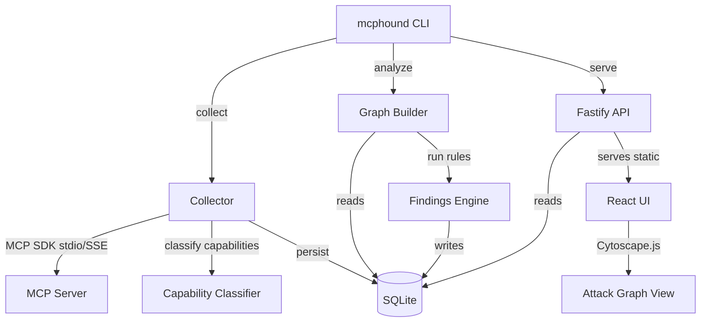

# MCPHound 🔍

> **BloodHound for your AI** — maps what your MCP servers can do, and hunts what they should not.

MCPHound is a read-only static analyser for [Model Context Protocol](https://modelcontextprotocol.io/) ecosystems. It enumerates your MCP servers, classifies tool capabilities using deterministic rules (no LLM required), builds an attack graph, and surfaces security findings — all in a local SQLite database with a visual web UI.

## Quickstart

```sh
# 1. Clone & install
git clone https://github.com/goldjg/mcphound.git
cd mcphound
pnpm install

# 2. Configure your MCP servers — create mcphound.config.json in the repo root:
cat > mcphound.config.json << 'EOF'
{
  "mcpServers": {
    "github": {
      "command": "npx",
      "args": ["-y", "@modelcontextprotocol/server-github"],
      "env": { "GITHUB_PERSONAL_ACCESS_TOKEN": "ghp_your_token_here" }
    }
  }
}
EOF

# 3. Build packages
pnpm build

# 4. Collect & analyze
node packages/cli/dist/index.js collect
node packages/cli/dist/index.js analyze

# 5. Serve the web UI
node packages/cli/dist/index.js serve
# → Open http://localhost:7474
```

MCPHound also auto-discovers Claude Desktop and VS Code MCP configurations. See [Configuration Discovery](#configuration-discovery) below.

## Architecture



## Capabilities

MCPHound classifies each tool with one or more capabilities using name/description/schema heuristics:

| Capability | Description | Risk Score |
|---|---|---|
| `RUN_SHELL` | Execute arbitrary shell commands | 90 |
| `EXECUTE_CODE` | Run code/scripts | 85 |
| `READ_SECRET` | Read secrets, tokens, credentials | 80 |
| `MUTATE_IDENTITY` | IAM, roles, permissions | 80 |
| `MUTATE_CLOUD_RESOURCE` | AWS/Azure/GCP resources | 75 |
| `EXPORT_DATA` | Bulk export/dump data | 70 |
| `SEND_EMAIL` | Send emails | 65 |
| `SEND_HTTP` | Make HTTP requests | 60 |
| `WRITE_LOCAL_FILE` | Write to local filesystem | 55 |
| `WRITE_REMOTE_DATA` | Write to remote systems | 55 |
| `QUERY_DATABASE` | Execute SQL queries | 50 |
| `CREATE_TICKET` | Create issues/PRs/tickets | 40 |
| `READ_REMOTE_DATA` | Read from remote sources | 35 |
| `READ_LOCAL_FILE` | Read local filesystem | 30 |
| `UNKNOWN` | Unclassified | 10 |

## Risk Categories

| Category | Description |
|---|---|
| `DATA_EXFILTRATION` | Server can read files AND make HTTP requests |
| `PRIVILEGED_MUTATION` | Tools that mutate cloud or identity resources |
| `CODE_EXECUTION` | Tools with shell/code execution capability |
| `TRUST_BOUNDARY_CROSSING` | Server hosted at non-localhost URL |
| `SENSITIVE_DATA_EXPOSURE` | Tools that can read secrets/credentials |
| `UNVERIFIED_SERVER` | Server not cryptographically verified |
| `OVERBROAD_TOOL` | Single tool with 4+ capabilities |
| `DANGEROUS_TOOL_CHAIN` | Server has READ_SECRET + SEND_HTTP (exfil chain) |

## Configuration Discovery

MCPHound discovers MCP servers from (in priority order):

1. `--config <path>` — explicit config file path
2. `mcphound.config.json` in the current directory
3. Claude Desktop config (`%APPDATA%\Claude\claude_desktop_config.json` on Windows, `~/Library/Application Support/Claude/...` on macOS)
4. VS Code settings (`~/.vscode/settings.json`, `mcpServers` key)
5. `--server <url>` — single server by URL

Config format (same as Claude Desktop):
```json
{
  "mcpServers": {
    "my-server": {
      "command": "node",
      "args": ["server.js"],
      "env": { "API_KEY": "..." }
    },
    "remote-server": {
      "url": "https://api.example.com/mcp/sse"
    }
  }
}
```

## CLI Reference

```
mcphound collect [--config <path>] [--server <url>] [--db <path>]
mcphound analyze [--collection <id>] [--db <path>]
mcphound serve [--port <n>] [--db <path>]
mcphound --help
```

## Web UI Views

- **Dashboard** — server/tool/finding counts, capability histogram, top risks
- **Graph** — Cytoscape.js attack graph with type/capability filters
- **Tools** — sortable table with capabilities and risk scores
- **Findings** — grouped by severity with remediation hints and "show on graph" links

## MVP Scope

**In scope:**
- Static analysis only — reads MCP server manifests, no tool calls executed
- Rules-based capability classification (deterministic, offline, reviewable)
- SQLite storage with append-only collections for future diffing
- Local web UI served by the API process

**Out of scope (post-MVP):**
- LLM-based tool testing / prompt injection probing
- Observed-call tracking (`observed_call` / `tested_path` edge types reserved)
- Multi-tenant / cloud deployment
- Historical diff views

## Safety Notes

- MCPHound **never calls your MCP tools** — it only reads the tool manifest (names, descriptions, schemas)
- API tokens/env vars found in configs are **redacted** before storage
- The SQLite database is local-only; no data leaves your machine
- Running `mcphound collect` against a remote server only calls `listTools`, `listResources`, and `listPrompts`

## Development

```sh
pnpm install
pnpm build        # build all packages
pnpm test         # run Vitest
pnpm typecheck    # TypeScript project references
pnpm lint         # ESLint
```

### Monorepo layout

```
apps/web        React + Vite + Cytoscape.js UI
apps/api        Fastify API server
packages/core        shared types + Zod schemas
packages/collector   config discovery + MCP client
packages/graph       graph builder + attack-path queries
packages/storage     SQLite schema + typed repositories
packages/rules       capability classifier + findings rules
packages/cli         mcphound CLI entry point
examples/safe-mcp    deterministic test fixture (MCP server with known tools)
```

## Roadmap

- **Post-MVP tester**: LLM-driven tool fuzzing, prompt injection probing, `observed_call`/`tested_path` edges
- **Diff view**: compare collections over time to detect new risks
- **CI integration**: `mcphound analyze --fail-on critical` exit code for pipelines
- **Policy-as-code**: custom YAML rules for organisation-specific findings

